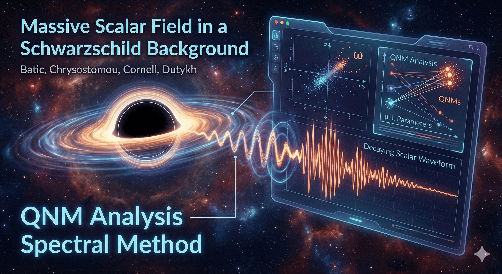

# Massive Scalar Field in a Schwarzschild background

Repository to accompany our paper:

**Quasinormal modes analysis of a massive scalar field in a Schwarzschild background via the Spectral Method**

by Davide Batic, Anna Chrysostomou, Alan Cornell, and Denys Dutykh — *Work in preparation*

- Davide Batic — Mathematics Department, Khalifa University of Science and Technology, Abu Dhabi, UAE
- Anna Chrysostomou — Laboratoire de Physique Théorique et Hautes Énergies (LPTHE), Sorbonne Université, CNRS, Paris, France
- Alan Cornell — Physics Department, University of Johannesburg, Johannesburg, South Africa
- Denys Dutykh — Mathematics Department, Khalifa University of Science and Technology, Abu Dhabi, UAE

Here we collect the main routines used in our computations along with the raw unprocessed results.



## Repository structure

```
massive-scalar/
├── LICENSE
├── README.md
├── data/                          — Raw computational results
│   ├── mu_0_L_0/raw/             — mu = 0, L = 0
│   │   ├── eigs_180.dat
│   │   ├── eigs_190.dat
│   │   └── eigs_200.dat
│   ├── mu_0_L_1/raw/             — mu = 0, L = 1
│   │   ├── eigs_180.dat
│   │   ├── eigs_190.dat
│   │   └── eigs_200.dat
│   ├── mu_0_L_2/raw/             — mu = 0, L = 2
│   │   ├── eigs_180.dat
│   │   ├── eigs_190.dat
│   │   └── eigs_200.dat
│   └── mu_0_1_L_0/raw/           — mu = 0.1, L = 0
│       ├── eigs_180.dat
│       ├── eigs_190.dat
│       └── eigs_200.dat
├── maple/                         — Maple worksheets
│   └── 02-Adapting to Spectral Method.mw
└── matlab/                        — MATLAB and Maple routines
    ├── chaseeigs.m                — Polynomial eigenvalue solver for QNMs
    └── matrixassembler.mpl        — Matrix assembly using Chebyshev collocation
```

The data files contain eigenvalues computed at 180, 190, and 200 digits of precision, organized by mass parameter (mu) and angular momentum quantum number (L).

## Analysing the data

The raw eigenvalue files in the `data/` directory can be loaded directly into **QNM Analyser**, an interactive web dashboard for exploring convergence of quasi-normal mode eigenvalues computed at different numerical resolutions.

- Source code: <https://github.com/dutykh/qnm-analyser/>
- Live instance: <https://www.qnm-anal.denys-dutykh.com/>

For each parameter pair (mu, L), upload the three resolution files (`eigs_180.dat`, `eigs_190.dat`, `eigs_200.dat`) into QNM Analyser to automatically identify converged QNMs, classify them (general, purely imaginary, or purely real), and export publication-ready plots and reports.

## License

This project is distributed under the [GNU Lesser General Public License v2.1](LICENSE). See the `LICENSE` file for details.

## Citation

If you use the codes, routines, or data provided in this repository, please acknowledge our work by citing the following paper:

```bibtex
@article{Batic2026,
  author  = {Batic, Davide and Chrysostomou, Anna and Cornell, Alan and Dutykh, Denys},
  title   = {Quasinormal modes analysis of a massive scalar field in a {S}chwarzschild background via the {S}pectral {M}ethod},
  year    = {2026},
  note    = {Work in preparation}
}
```
