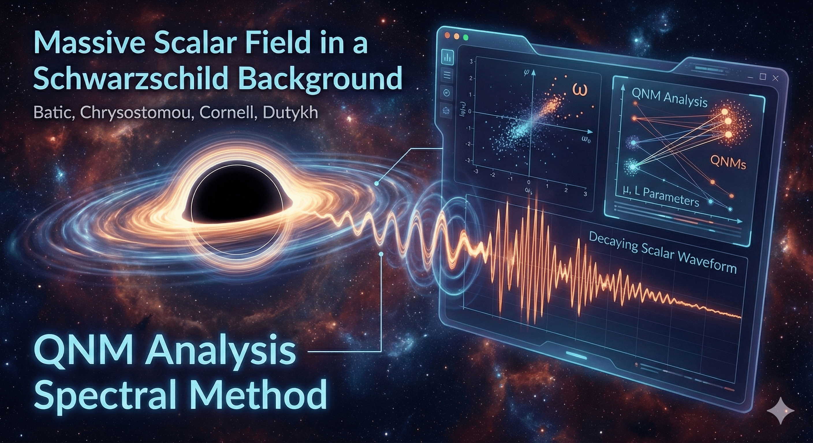

# Massive Scalar Field in a Schwarzschild background

Repository to accompany our paper:

**Quasinormal modes analysis of a massive scalar field in a Schwarzschild background via the Spectral Method**

by Davide Batic, Anna Chrysostomou, Alan S. Cornell, and Denys Dutykh — *Preprint, April 2026*

- Davide Batic — Mathematics Department, Khalifa University of Science and Technology, Abu Dhabi, UAE
- Anna Chrysostomou — Laboratoire de Physique Théorique et Hautes Énergies (LPTHE), Sorbonne Université, CNRS, Paris, France
- Alan S. Cornell — Department of Physics, University of Johannesburg, Auckland Park, South Africa
- Denys Dutykh — Mathematics Department, Khalifa University of Science and Technology, Abu Dhabi, UAE

Here we collect the main routines used in our computations along with the raw unprocessed results.



## Repository structure

```
massive-scalar/
├── LICENSE
├── README.md
├── assets/
│   └── QNM_illustration.png
├── data/                          — Raw computational results (47 parameter cases)
│   └── mu_<mu>_L_<L>/            — one directory per (mu, L) pair
│       ├── raw/
│       │   ├── eigs_180.dat
│       │   ├── eigs_190.dat
│       │   └── eigs_200.dat
│       └── *_report.txt           — convergence report (when available)
├── maple/                         — Maple routines
│   ├── 02-Adapting to Spectral Method.mw
│   └── matrixassembler.mpl        — Matrix assembly using Chebyshev collocation
├── mathematica/                   — Mathematica notebooks
│   └── Massive-Scalar-QNMs_Schwarzschild_02-04-2026.nb
├── matlab/                        — MATLAB routines
│   └── chaseeigs.m                — Polynomial eigenvalue solver for QNMs
└── pdf/                           — Paper preprint
    └── DB-AC2-DD-QNMsMassiveScalarField-2026.pdf
```

### Data

The `data/` directory contains 47 parameter cases covering the following values:

- **mu** (scaled mass parameter): 0, 0.1, 0.2, 0.5, 0.7, 0.8, 1.0, 1.3, 1.4, 1.42, 1.45, 1.50, 2.0, 2.2, 3.0, 10, 100
- **L** (angular momentum, L = l(l+1)): 0, 1, 2, 10

Each case contains eigenvalues computed at 180, 190, and 200 digits of precision. Most directories also include a convergence report generated by QNM Analyser.

The Mathematica notebook (by A. Chrysostomou) generates Figures 1 and 2 of the paper. Figure 1 shows the effective quasinormal mode potential as a function of x = r/(2M) for increasing values of the scaled mass parameter mu. Figure 2 is a two-panel figure: the left panel displays the parameter space where V_peak > mu^2, with two benchmark points marked (mu = 0.5, L = 2 and mu = 0.5, L = 6, where L = l(l+1)); the right panel sketches the corresponding effective potentials.

## Analysing the data

The raw eigenvalue files in the `data/` directory can be loaded directly into **QNM Analyser**, an interactive web dashboard for exploring convergence of quasi-normal mode eigenvalues computed at different numerical resolutions.

- Source code: <https://github.com/dutykh/qnm-analyser/>
- Live instance: <https://www.qnm-anal.denys-dutykh.com/>

For each parameter pair (mu, L), upload the three resolution files (`eigs_180.dat`, `eigs_190.dat`, `eigs_200.dat`) into QNM Analyser to automatically identify converged QNMs, classify them (general, purely imaginary, or purely real), and export publication-ready plots and reports.

## License

This project is distributed under the [GNU Lesser General Public License v2.1](LICENSE). See the `LICENSE` file for details.

## Citation

If you use the codes, routines, or data provided in this repository, please acknowledge our work by citing the following paper:

```bibtex
@article{Batic2026,
  author  = {Batic, Davide and Chrysostomou, Anna and Cornell, Alan S. and Dutykh, Denys},
  title   = {Quasinormal modes analysis of a massive scalar field in a {S}chwarzschild background via the {S}pectral {M}ethod},
  year    = {2026},
  note    = {Preprint, April 2026}
}
```
